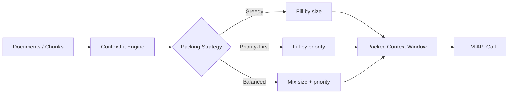

# ContextFit

[](https://github.com/officethree/contextfit/actions/workflows/ci.yml)
[](https://www.python.org/downloads/)
[](LICENSE)
[](https://pypi.org/project/contextfit/)

**Context window packing optimizer** — a Python library that optimally packs documents and chunks into LLM context windows to maximize information density while respecting token limits.



## Quickstart

### Installation

```bash
pip install contextfit
```

### Usage

```python
from contextfit import ContextFit

cf = ContextFit()

# Add chunks with optional priority and metadata
cf.add_chunk("This is a document about Python.", priority=5, metadata={"source": "docs"})
cf.add_chunk("Another important chunk of text.", priority=9, metadata={"source": "notes"})
cf.add_chunk("Less important filler content.", priority=2)

# Pack into a context window with a token budget
result = cf.pack(max_tokens=100, strategy="priority-first")

print(f"Packed {len(result.chunks)} chunks")
print(f"Utilization: {cf.get_utilization():.1%}")
print(f"Stats: {cf.get_stats()}")

# Reorder chunks by relevance to a query
cf.reorder_by_relevance("Python programming")

# Trim a single text to fit a token limit
trimmed = cf.trim_to_fit("A very long document...", max_tokens=10)
```

### Packing Strategies

| Strategy | Description |
|---|---|
| `greedy` | Fills the context window with chunks in insertion order until the budget is exhausted. |
| `priority-first` | Sorts chunks by priority (highest first) and packs greedily. |
| `balanced` | Scores chunks by `priority / token_count` to maximize information density per token. |

### Configuration

```python
from contextfit import ContextFit, ContextFitConfig

config = ContextFitConfig(
    tokens_per_word=1.33,
    separator="\n\n",
    default_priority=5,
)

cf = ContextFit(config=config)
```

---

Inspired by LLM context optimization trends.

---

Built by [Officethree Technologies](https://officethree.com) | Made with love and AI
